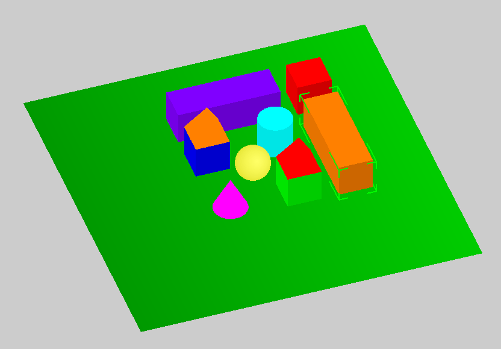
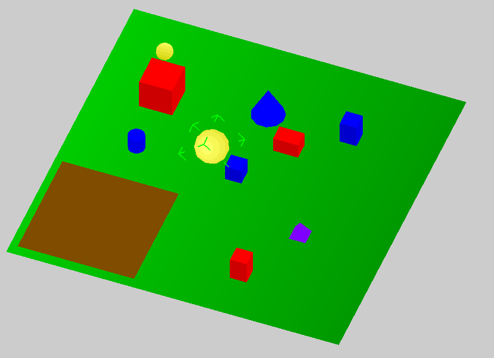

# 3D puzzle
This was a 2016. project for a course in computer graphics. It's done in "OG" OpenGL and it enables simple manipulation of
geometric objects with real-time adjustable precision of the round objects.
It also has a game mode where the user is asked to separate object with specific properties into a specified region
before the time runs out.

